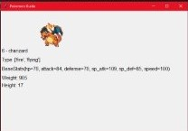

<h1>Pokemon Guide</h1>

<h2>Descrição</h2>

   
   É um guia pra ajudar a saber sobre os pokemons  
   na qual mostra o nome, indíce, tipo, status base e a imagem do pokemon.
   Foi desenvolvido com Python

 
   <h2>Pesquisa o Pokemon</h2>
   

 
   <h2>Resultado da pesquisa</h2>
   

<footer>Foi desenvolvido por &copy; Wilson Rivero </footer>
